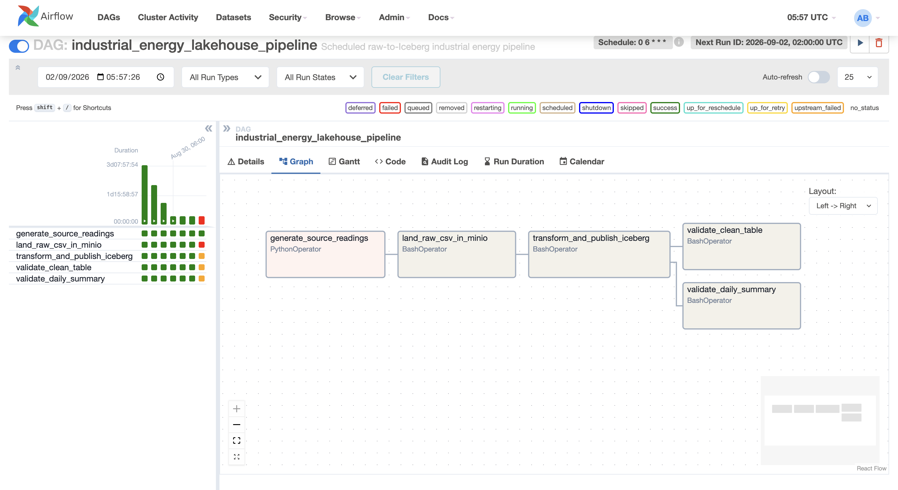

<h1 align="center">on-premises lakehouse + copilot proof of concept</h1>

this project demonstrates a vendor-neutral data lakehouse designed to run entirely on-premises. It combines MinIO, Apache Iceberg, Spark, Trino, NiFi, Airflow, SQL Server, OpenMetadata, and Power BI to ingest, transform, govern, query, and visualise data. It also includes an operations copilot powered by Ollama and Qwen3 using BGE-M3 embeddings, PostgreSQL w pgvector, and hybrid RAG retrieval to help engineers investigate platform issues.

<h2 align="center">lakehouse operations portal</h2>


<h2 align="center">copilot using RAG</h2>


<h2 align="center">architecture</h2>

```text
data sources (sql server) -> NiFi/airflow -> minIO + iceberg -> spark -> trino -> power bi
                                    |
                            ro operations copilot
```

- **MinIO** stores raw and curated data on-premises
- **Iceberg** provides an open table format and transactional metadata
- **Spark** performs scalable transformations
- **Trino** exposes iceberg tables through SQL and ODBC
- **Airflow** schedules, retries, automates and audits multi-step workflows
- **NiFi** handles bulk ingestion and data movement
- **Power BI** consumes curated data visualisations through trino
- **OpenMetaData**  catalogues, describes and classifies data
- **Operations Copilot** retrieves relevant runbooks and incident evidence,
  checks selected live platform data, and produces cited, read-only guidance

<h2 align="center">repo layout</h2>

```text
.
├── docker-compose.yml             # one-command POC environment
├── platform/                      # shared platform config
│   ├── docker/airflow/
│   ├── copilot/                    # api, evidence, database migrations and evaluation
│   ├── nifi/drivers/
|   ├── portal/                    # lakehouse portal code
│   └── trino/catalog/
├── domains/                       # business owned data products
│   ├── demo-artists/
│   ├── industrial-energy/
│   └── transport/taxi/
└── data/generated/                # runtime data excluded from git because of size
```

<h2 align="center">how to start the POC</h2>

- create a local credentials file and replace every `change-me` value before
starting the services:

```bash
cp .env.example .env
```

```bash
docker compose up -d --build
```

- the copilot uses a local Ollama model by default. 
install ollama on the host and make the configured model available before asking questions:

```bash
ollama pull qwen3:8b
```

- index the bundled runbooks and incident documents after the first startup (and
again whenever those documents change):

```bash
docker compose exec copilot-api python -m app.ingest
```

<h3 align="center">Service endpoints</h3>

<div align="center">
  <table>
    <thead>
      <tr>
        <th>Service</th>
        <th>URL</th>
        <th>Credentials</th>
      </tr>
    </thead>
    <tbody>
      <tr>
        <td>Lakehouse portal</td>
        <td><a href="http://localhost:3000">http://localhost:3000</a></td>
        <td>None</td>
      </tr>
      <tr>
        <td>Operations Copilot</td>
        <td><a href="http://localhost:3000/copilot.html">http://localhost:3000/copilot.html</a></td>
        <td>None</td>
      </tr>
      <tr>
        <td>Copilot API</td>
        <td><a href="http://localhost:8100">http://localhost:8100</a></td>
        <td>None</td>
      </tr>
      <tr>
        <td>Airflow</td>
        <td><a href="http://localhost:8090">http://localhost:8090</a></td>
        <td>Configured in <code>.env</code></td>
      </tr>
      <tr>
        <td>Trino</td>
        <td><a href="http://localhost:8080">http://localhost:8080</a></td>
        <td>No authentication</td>
      </tr>
      <tr>
        <td>MinIO API</td>
        <td><a href="http://localhost:9000">http://localhost:9000</a></td>
        <td>Configured in <code>.env</code></td>
      </tr>
      <tr>
        <td>MinIO console</td>
        <td><a href="http://localhost:9001">http://localhost:9001</a></td>
        <td>Configured in <code>.env</code></td>
      </tr>
      <tr>
        <td>NiFi</td>
        <td><a href="https://localhost:8443">https://localhost:8443</a></td>
        <td>Configured in <code>.env</code></td>
      </tr>
      <tr>
        <td>OpenMetadata</td>
        <td><a href="http://localhost:8585">http://localhost:8585</a></td>
        <td><code>admin</code> / <code>admin</code></td>
      </tr>
    </tbody>
  </table>
</div>

<h2 align="center">operations copilot using RAG</h2>

the copilot is a local ai assistant that helps find you answers based on evidence.
A question is classified, matched against indexed knowledge using keyword and semantic retrieval, checked for sufficient evidence, and then sent to the local language model. Answers with findings, recommended checks, and supporting citations. 
If the evidence is insufficient, the copilot will say so instead of inventing an answer

try asking these questions:

- `why did the latest Spark ingestion fail?`
- `why can't this user access the Iceberg catalog?`
- `which Iceberg tables may have too many small files?`
- `what should I check before restarting MinIO?`

the copilot can read indexed runbooks and incidents and expose predefined,
read-only diagnostics for airflow, trino, iceberg, and platform health

- check that the api and model are ready with:

```bash
curl http://localhost:8100/health
curl http://localhost:11434/api/tags
```

see [the copilot guide](platform/copilot/README.md) for more about its architecture, api, configuration, evidence format, evaluation commands, and troubleshooting

<h2 align="center">start the governance profile</h2>

openMetaData is optional because its metadata database and search index require
additional memory

start it alongside the core platform with:

```bash
docker compose --profile governance up -d openmetadata-server openmetadata-ingestion
```

the first startup pulls the pinned openMetaData, ingestion, MySQL, and
elasticsearch images, runs the metadata schema migration, and can take several minutes

the bundled openMetaData ingestion scheduler runs internally to execute connector tests and metadata ingestion; the poc's existing airflow remains responsible for business DAGs

<h2 align="center">demo for the industrial engery pipeline</h2>

the `industrial_energy_lakehouse_pipeline` airflow DAG runs daily at 06:00
asia/muscat and executes:



```text
generate readings
  -> land bronze Iceberg data in MinIO
  -> clean and aggregate with Spark
  -> validate clean and summary tables through Trino
```

query the power bi-ready output:

```bash
docker exec trino trino --execute \
  "SELECT * FROM iceberg.demo.industrial_energy_daily_summary"
```

or connect via datagrip to debug or see the data clearly:


see [the industrial-energy domain guide](domains/industrial-energy/README.md)
for the detailed demo flow.
