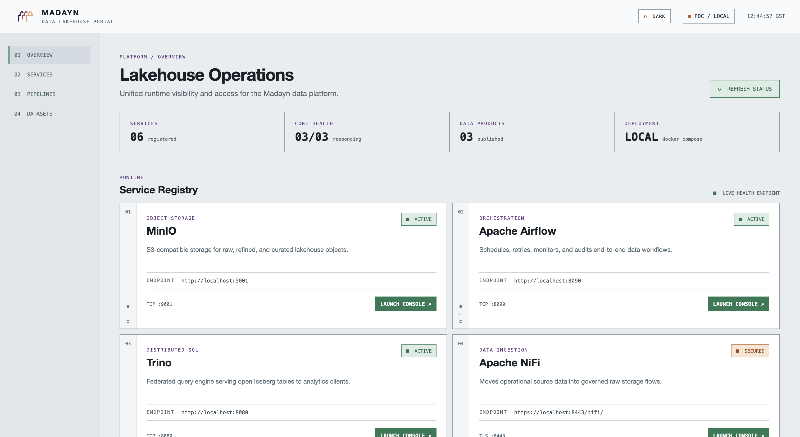

# On-Premises Lakehouse POC

This repo demonstrates a vendor-neutral, on-premises data lakehouse using
MinIO, Apache Iceberg, Spark, Trino, NiFi, Airflow, SQL Server, and Power BI.

### Lakehouse operations portal



## Architecture

```text
Sources -> NiFi/Airflow -> MinIO + Iceberg -> Spark -> Trino -> Power BI
```

- **MinIO** stores raw and curated data on-premises.
- **Iceberg** provides an open table format and transactional metadata.
- **Spark** performs scalable transformations.
- **Trino** exposes Iceberg tables through SQL and ODBC.
- **Airflow** schedules, retries, and audits multi-step workflows.
- **NiFi** handles bulk ingestion and data movement.
- **Power BI** consumes curated data through Trino.

## Repository layout

```text
.
├── docker-compose.yml             # One-command POC environment
├── platform/                      # Shared platform configuration
│   ├── docker/airflow/
│   ├── nifi/drivers/
│   └── trino/catalog/
├── domains/                       # Business-owned data products
│   ├── demo-artists/
│   ├── industrial-energy/
│   └── transport/taxi/
└── data/generated/                # Runtime data; excluded from Git
```

Each domain owns its orchestration, transformation logic, tests, contracts, and
documentation. Shared infrastructure remains under `platform/`.

## To start the POC

```bash
docker compose up -d --build
```

Service endpoints:

| Service | URL | Credentials |
|---|---|---|
| Lakehouse Portal | http://localhost:3000 | none |
| Airflow | http://localhost:8090 | `admin` / `admin` |
| Trino | http://localhost:8080 | no authentication (POC only) |
| MinIO API | http://localhost:9000 | configured in `.env` |
| MinIO Console | http://localhost:9001 | configured in `.env` |
| NiFi | https://localhost:8443 | configured in Compose |
| OpenMetadata | http://localhost:8585 | `admin` / `admin` (POC only) |

The **Lakehouse Portal** is the recommended entry point for the demo. It
shows platform health, explains the role of each component, and opens every
tool without requiring users to remember individual ports. When accessed from
another computer, its links automatically use the same host name or IP address
as the portal.

### Start the governance profile

OpenMetadata is optional because its metadata database and search index require
additional memory. Start it alongside the core platform with:

```bash
docker compose --profile governance up -d openmetadata-server openmetadata-ingestion
```

The first startup pulls the pinned OpenMetadata, ingestion, MySQL, and
Elasticsearch images, runs the metadata schema migration, and can take several minutes. Open
the governance catalog at <http://localhost:8585>. The bundled OpenMetadata
ingestion scheduler runs internally to execute connector tests and metadata
ingestion; the POC's existing Airflow remains responsible for business DAGs.


## Primary demonstration

The `industrial_energy_lakehouse_pipeline` Airflow DAG runs daily at 06:00
Asia/Muscat and performs:

```text
generate readings
  -> land bronze Iceberg data in MinIO
  -> clean and aggregate with Spark
  -> validate clean and summary tables through Trino
```

Query the Power BI-ready output:

```bash
docker exec trino trino --execute \
  "SELECT * FROM iceberg.demo.industrial_energy_daily_summary"
```

See [the industrial-energy domain guide](domains/industrial-energy/README.md)
for the detailed demo flow.

## POC versus production

This repository prioritises a clear single-machine demonstration. A production
deployment should use separate development, test, and production environments;
external secret management; TLS and identity-based access; PostgreSQL for
Airflow metadata; highly available services; immutable job images; and a
controlled Spark job-submission API instead of mounting the Docker socket.
