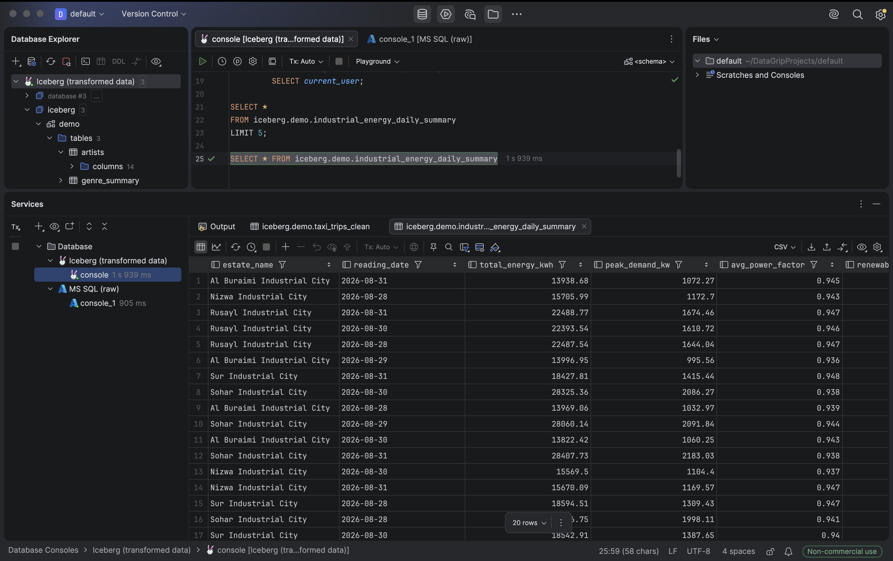

<h1 align="center">on-premises lakehouse + copilot proof of concept</h1>

this repo demonstrates a vendor-neutral, on-premises data lakehouse using
MinIO, Apache Iceberg, Spark, Trino, NiFi, Airflow, SQL Server, OpenMetadata and Power BI I designed during my internship

<h2 align="center">lakehouse operations portal</h2>


<h2 align="center">coplilot using RAG</h2>


<h2 align="center">architecture</h2>

```text
data sources (sql server) -> NiFi/airflow -> minIO + iceberg -> spark -> trino -> power bi
```

- **MinIO** stores raw and curated data on-premises
- **Iceberg** provides an open table format and transactional metadata
- **Spark** performs scalable transformations
- **Trino** exposes iceberg tables through SQL and ODBC
- **Airflow** schedules, retries, automates and audits multi-step workflows
- **NiFi** handles bulk ingestion and data movement
- **Power BI** consumes curated data visualisations through trino
- **OpenMetaData**  catalogues, describes and classifies data

## repo layout

```text
.
├── docker-compose.yml             # one-command POC environment
├── platform/                      # shared platform config
│   ├── docker/airflow/
│   ├── nifi/drivers/
|   ├── portal/                    # lakehouse portal code
│   └── trino/catalog/
├── domains/                       # business owned data products
│   ├── demo-artists/
│   ├── industrial-energy/
│   └── transport/taxi/
└── data/generated/                # runtime data excluded from git because of size
```

each domain owns its orchestration, transformation logic, tests, contracts, and
documentation. shared infrastructure remains under `platform/`.

## to start the POC

create a local credentials file and replace every `change-me` value before
starting the services. `.env` is intentionally excluded from git:

```bash
cp .env.example .env
```

```bash
docker compose up -d --build
```

service endpoints:

| service | url | credentials |
|---|---|---|
| lakehouse portal | http://localhost:3000 | none |
| airflow | http://localhost:8090 | configured in `.env` |
| trino | http://localhost:8080 | no authentication (poc only) |
| minIO API | http://localhost:9000 | configured in `.env` |
| minIO console | http://localhost:9001 | configured in `.env` |
| nifi | https://localhost:8443 | configured in `.env` |
| openMetaData | http://localhost:8585 | `admin` / `admin` (poc only) |

the **lakehouse portal** is the recommended entry point for the demo.
it shows platform health, explains the role of each component, and opens every
tool without requiring users to remember individual ports

### start the governance profile

openMetaData is optional because its metadata database and search index require
additional memory

 Start it alongside the core platform with:

```bash
docker compose --profile governance up -d openmetadata-server openmetadata-ingestion
```

the first startup pulls the pinned openMetaData, ingestion, MySQL, and
elasticsearch images, runs the metadata schema migration, and can take several minutes

the bundled openMetaData ingestion scheduler runs internally to execute connector tests and metadata ingestion; the poc's existing airflow remains responsible for business DAGs

## demo

the `industrial_energy_lakehouse_pipeline` airflow DAG runs daily at 06:00
asia/muscat and executes:


```text
generate readings
  -> land bronze Iceberg data in MinIO
  -> clean and aggregate with Spark
  -> validate clean and summary tables through Trino
```

query the power bi-ready output:

```bash
docker exec trino trino --execute \
  "SELECT * FROM iceberg.demo.industrial_energy_daily_summary"
```

or connect via datagrip to debug or see the data clearly:



see [the industrial-energy domain guide](domains/industrial-energy/README.md)
for the detailed demo flow.
